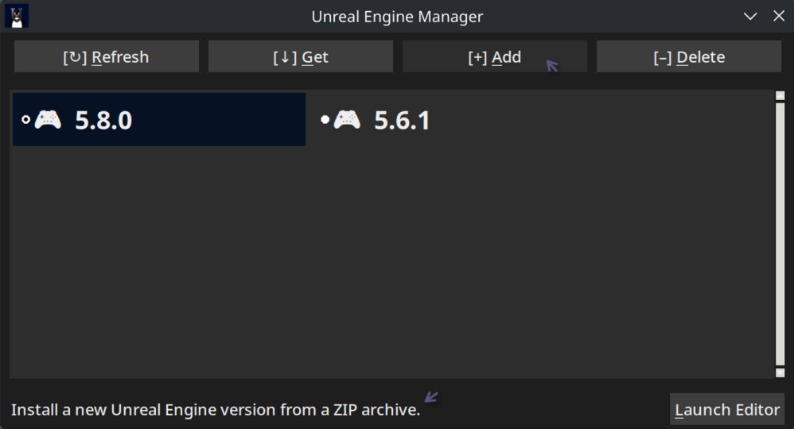

# Unreal Engine Manager

## Summary

A Linux application for managing Unreal Engine installations. This is not a fancy Epic Games Launcher 
replacement - instead, this application is meant to be minimal and bloat-free. Put simply, it is a GUI-enabled and
user-friendly alternative to the unreal-engine-bin AUR package, written exclusively in pure Python.

## Installation

This package is available as an [AUR package](https://aur.archlinux.org/packages/unreal-engine-manager). To 
install it, you can use any AUR helper such as `paru` or `yay`. Example: `paru -S unreal-engine-manager`.

Alternatively, you can clone this repository and use this application by running `python ./source/main.py`. 
The only dependency is `tk` (**tkinter**).

## Usage

The application has a straightforward graphical user interface. Hovering over any widget will display a tooltip with
additional information at the bottom of the window.

To install a new version of Unreal Engine, you must provide your own ZIP archive, sourced from the [Unreal Engine for
Linux](https://www.unrealengine.com/linux) webpage. This link is also accessible from within the application (via the
"Get" button). Sourcing your own ZIP archive eliminates the need to log into your Epic Games account using a third-party
application, which many users find undesirable (usually due to security concerns).

## Features

The Unreal Engine Manager is capable of performing the following tasks:

- Fetching Unreal Engine installations from `/opt/unreal-engine-bin/`.
- Opening the Unreal Engine for Linux downloads page.
- Installing a new Unreal Engine version from a user-sourced ZIP archive.
- Associating Unreal Engine project files (`.uproject`) with Unreal Engine.
- Generating a new `.desktop` shortcut for a specific Unreal Engine version.
- Launching the Unreal Editor for a specific Unreal Engine version.
- Uninstalling a specific version of Unreal Engine.

## Contributions

Anyone is welcome to contribute to this project. If you have any suggestions or improvements, please feel free to open
an issue and/or pull request. Even just reporting a bug is appreciated!

## Disclaimer

This is an application I originally made for myself, then decided to share. I am not affiliated with Epic Games in any
way. Use this at your own risk, as I am not responsible for any damages or losses that may occur.
